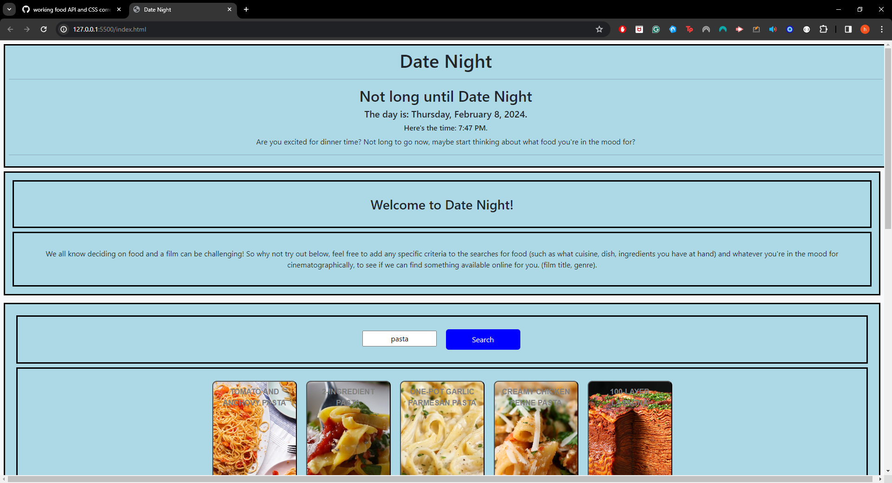
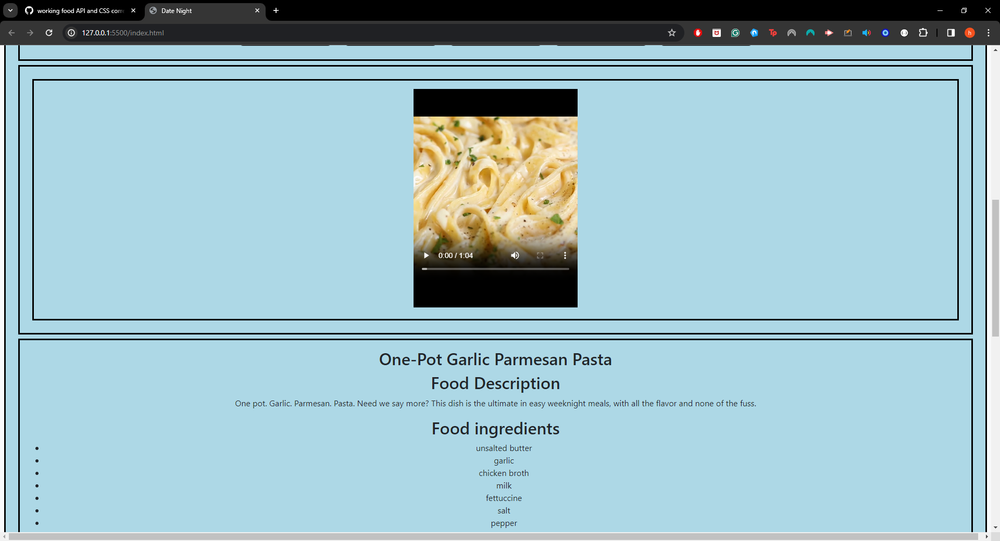
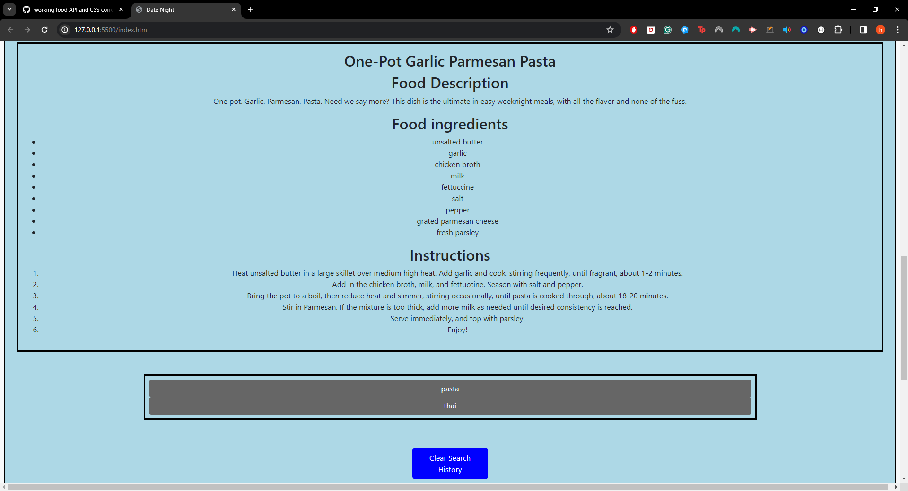
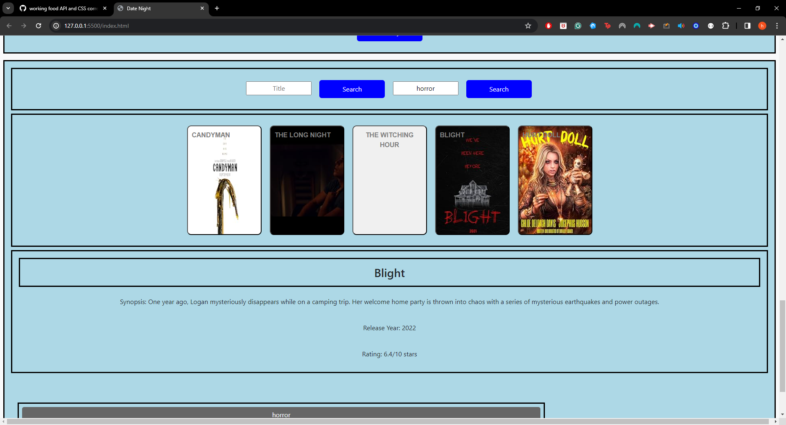
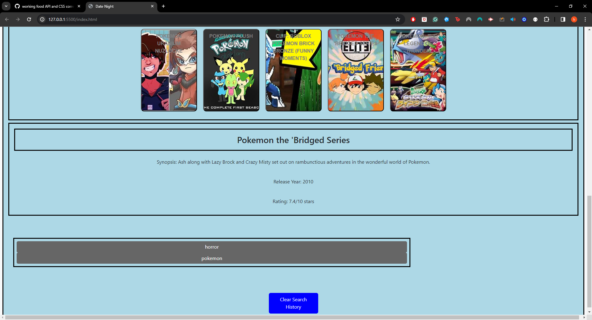

# DateNight - Group 7 Project 1

DateNight is an engaging web application that seamlessly combines the worlds of gastronomy and cinema, providing users with specific search criteria and random recommendations for a delightful night in.

## Description

We meticulously crafted this project to highlight our teamwork skills and collaborative efforts as our primary focus. Leveraging our diverse knowledge sets, we applied our skills in utilizing two separate APIs, local storage, and various JavaScript techniques, complemented by a rudimentary understanding of HTML and CSS (including Bootstrap). Our brainstorming led us to the concept of merging food and films into a basic web app, allowing users to search for films and food based on specific criteria or generate random suggestions by food type or genre. 

Tasks were assigned to each team member, and roles were interchanged when necessary for additional support in specific areas. Through code reviews and self-organized teamwork, we debugged and corrected code, ensuring the functionality and implementation of dynamically generated HTML alongside JavaScript were near perfection. The latter part of the project focused on enhancing CSS for a more polished, user-friendly look. We also ensured Bootstrap functionality, interactivity, correct API usage, client storage, and maintained a well-structured repository. Finally, we dedicated time to refining the README and preparing for the project presentation.

When brainstorming project ideas, we considered two separate concepts that could be seamlessly integrated using APIs. The winning combination that resonated with the team was "Date Night," revolving around the delightful pairing of food and films. We chose APIs that allowed us to search for specifics and receive recommendations based on genre and dish types, catering to indecisive users.

Before starting the project, we outlined general roles, maintaining flexibility to ensure all team members could provide additional support as needed. Initial roles included:

- **Harry:**
  - Project Management and Structure
  - Git Permissions and Conflict Resolution
  - Debugging and Support with CSS, APIs, and JS

- **Amr:**
  - CSS Styling and Structure
  - Color Scheme Mockups
  - Application of CSS for a Clean and Polished Look
  - JS and API Implementation

- **Gaston:**
  - Recipe API Integration
  - Coordination with API Team on Output Structure
  - Local Storage Implementation for Saved Buttons
  - Transition to CSS and Visual Enhancements

- **Nana:**
  - Film API Integration
  - Coordination with API Team on Output Structure
  - Local Storage Implementation for Saved Buttons
  - Transition to CSS and Visual Enhancements

We opted for two specific APIs after minor reconsiderations from the initial selection, listed below:

- [Tasty API](https://rapidapi.com/apidojo/api/tasty)
- [OTT Details API](https://rapidapi.com/gox-ai-gox-ai-default/api/ott-details)

## Table of Contents

* [Credits](#credits)
* [License](#license)
* [Link](#link)
* [Screenshot](#screenshot)

## Links

* **Deployed:** [Date Night](https://hpro97.github.io/DateNight/)
* **GitHub Repo:** [Project 1 Date Night](https://github.com/hpro97/DateNight)
* **Assets File:** [assets](https://github.com/hpro97/DateNight/tree/main/assets)
* **Slides:** [slideshow](https://docs.google.com/presentation/d/e/2PACX-1vSVAdiR41x7UrWyeAROr3MmhAT_F5cg21vnzI3zR6jCaoxBDPHQR9FKXrYffSUqRZMiwy3trHFrr3nT/pub?start=false&loop=false&delayms=3000)

## Screenshot

 
 
 
 

## Credits

We extend our gratitude to the following resources:

* **Stack Overflow:** Clarification on coding queries.
* **W3Schools:** Insights into JavaScript functions, local storage examples, CSS, Bootstrap, and code syntax structure.
* **Rapid API:** Documentation on the usage of both APIs.
* **Bootstrap:** Documentation on examples and correct usage.
* **jQuery:** Clarification on usage and guidance on architectural aspects.

## License

Copyright (c) 2024

Permission is hereby granted, free of charge, to any person obtaining a copy
of this software and associated documentation files (the "Software"), to deal
in the Software without restriction, including without limitation the rights
to use, copy, modify, merge, publish, distribute, sublicense, and/or sell
copies of the Software, and to permit persons to whom the Software is
furnished to do so, subject to the following conditions:

The above copyright notice and this permission notice shall be included in all
copies or substantial portions of the Software.

THE SOFTWARE IS PROVIDED "AS IS," WITHOUT WARRANTY OF ANY KIND, EXPRESS OR
IMPLIED, INCLUDING BUT NOT LIMITED TO THE WARRANTIES OF MERCHANTABILITY,
FITNESS FOR A PARTICULAR PURPOSE AND NONINFRINGEMENT. IN NO EVENT SHALL THE
AUTHORS OR COPYRIGHT HOLDERS BE LIABLE FOR ANY CLAIM, DAMAGES OR OTHER
LIABILITY, WHETHER IN AN ACTION OF CONTRACT, TORT OR OTHERWISE, ARISING FROM,
OUT OF OR IN CONNECTION WITH THE SOFTWARE OR THE USE OR OTHER DEALINGS IN THE
SOFTWARE.
